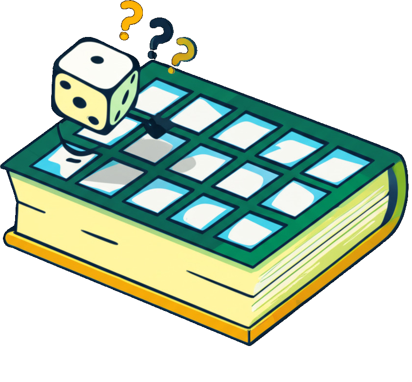
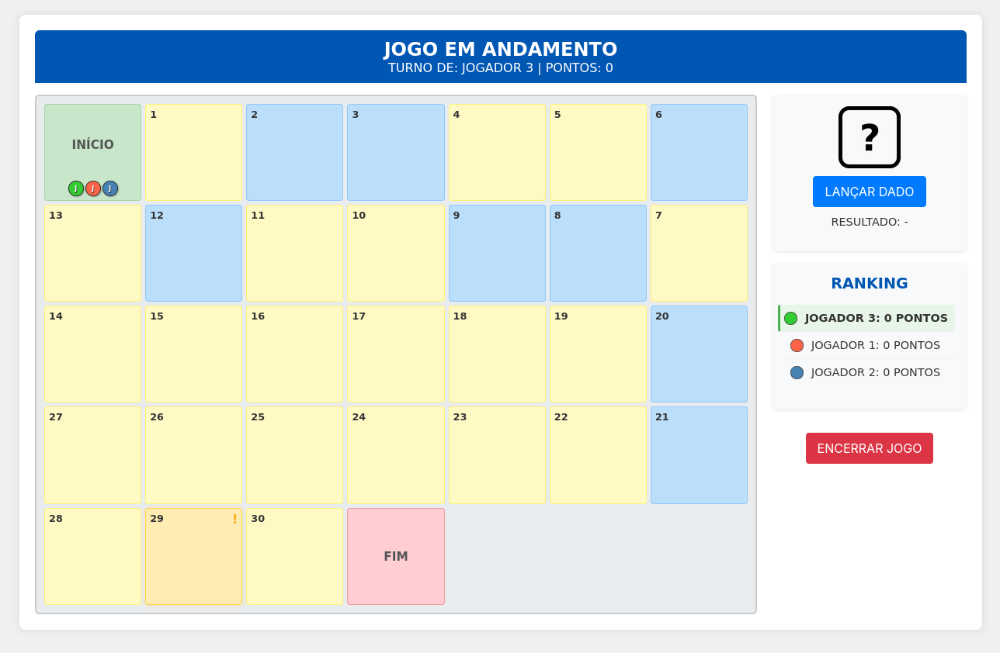

# Desafio do Conhecimento - Jogo de Tabuleiro Digital Educativo

 <!-- Sugestão: Adicione seu logo aqui -->

Bem-vindo ao **Desafio do Conhecimento**! Este é um jogo de tabuleiro digital interativo e altamente personalizável, projetado para transformar o aprendizado em uma aventura divertida e engajadora para alunos de diversas idades e níveis.

O objetivo é simples: avance pelo tabuleiro respondendo a perguntas desafiadoras, enfrente casas especiais com efeitos surpreendentes e acumule o máximo de pontos para se consagrar no pódio dos maiores exploradores do saber!

## Sumário

*   [Funcionalidades](#funcionalidades)
*   [Como Jogar](#como-jogar)
    *   [Tela de Splash (Inicialização)](#tela-de-splash-inicialização)
    *   [1. Cadastro de Jogadores](#1-cadastro-de-jogadores)
    *   [2. Configuração da Partida](#2-configuração-da-partida)
    *   [3. O Jogo](#3-o-jogo)
    *   [4. Fim de Jogo e Pódio](#4-fim-de-jogo-e-pódio)
*   [Personalização Avançada](#personalização-avançada)
    *   [Editando Perguntas (`perguntas.json`)](#editando-perguntas-perguntasjson)
    *   [Editando Ações Especiais (`acoes_especiais.json`)](#editando-ações-especiais-acoes_especiaisjson)
*   [Estrutura de Pastas do Projeto](#estrutura-de-pastas-do-projeto)
*   [Como Configurar e Executar Localmente](#como-configurar-e-executar-localmente)
*   [Tecnologias Utilizadas](#tecnologias-utilizadas)
*   [Contribuições](#contribuições)
*   [Autor](#autor)
*   [Licença](#licença)

## Funcionalidades

Este jogo foi construído com foco na flexibilidade e na experiência do usuário, oferecendo:

*   🎲 **Tabuleiro Dinâmico:** Configure o número total de casas no tabuleiro (entre 10 e 100) para ajustar a duração e complexidade da partida.
*   🧑‍🤝‍🧑 **Múltiplos Jogadores:** Suporte para até 40 jogadores, cada um com um avatar e cor de peão distintos para fácil identificação.
*   🧠 **Banco de Perguntas Personalizável:**
    *   As perguntas são carregadas externamente do arquivo `data/perguntas.json`, permitindo que educadores e usuários adicionem, removam ou modifiquem o conteúdo facilmente.
    *   Suporte para perguntas de múltipla escolha e verdadeiro/falso.
    *   Cada pergunta pode ter um tempo limite individual para resposta.
*   ⚙️ **Filtros Avançados de Perguntas:** Na tela de configuração, refine o conjunto de perguntas que aparecerão no jogo com base em:
    *   **Componente Curricular:** (Ex: Matemática, Português, Ciências) - Seleção múltipla.
    *   **Conteúdo Específico/Tópico:** (Ex: Potenciação, Verbos, Sistema Solar) - Lista dinâmica baseada nos filtros anteriores. Seleção múltipla.
    *   **Ano/Turma:** (Ex: 6º Ano, 7º Ano) - Seleção múltipla.
    *   **Bimestre:** (Ex: 1º Bimestre, 2º Bimestre) - Seleção múltipla.
    *   **Nível de Dificuldade:** (Ex: Fácil, Médio, Difícil) - Seleção única.
*   ✨ **Casas Especiais Interativas:**
    *   O tabuleiro pode conter casas especiais que acionam efeitos variados, como avançar/voltar casas, ganhar/perder pontos, trocar de posição com outro jogador, e muitos outros.
    *   As ações são definidas no arquivo `data/acoes_especiais.json`, permitindo customização.
*   💯 **Sistema de Pontuação Configurável:**
    *   Defina na tela de configuração quantos pontos valem as perguntas de cada nível de dificuldade (Fácil, Médio, Difícil), sobrepondo os valores padrão do arquivo de perguntas.
    *   Opção para permitir ou não pontuação negativa.
*   📊 **Ranking em Tempo Real:** Acompanhe a pontuação e a classificação dos jogadores na barra lateral durante toda a partida.
*   ⏱️ **Timers Dinâmicos:**
    *   **Timer para Lançar o Dado:** Adiciona um elemento de pressão e agilidade, configurável na tela de setup.
    *   **Timer para Responder Perguntas:** Cada pergunta tem seu próprio tempo limite.
*   🏆 **Pódio Animado e Classificação Final:** Ao final da partida, os três jogadores com maior pontuação são celebrados em um pódio animado, seguido por uma tabela com a classificação completa de todos os participantes.
*   🎨 **Design Moderno e Atraente:** Interface limpa, com uma paleta de cores vibrante e a fonte Nunito, pensada para ser agradável e intuitiva para o público estudantil.
*   👁️ **Opção de Acessibilidade Visual:** Possibilidade de exibir todos os textos do jogo em CAIXA ALTA.
*   🔊 **Efeitos Sonoros:** (Opcional) Efeitos para rolagem de dados, movimento de peões, respostas corretas/incorretas e eventos especiais, tornando a experiência mais imersiva.
*   🎬 **Animações:** Movimento suave dos peões no tabuleiro, animação do dado e apresentação dinâmica do pódio.

## Como Jogar

### Tela de Splash (Inicialização)


Ao abrir o jogo, você será recebido por uma tela de boas-vindas enquanto os recursos são carregados.
*   Aguarde a mensagem "Tudo pronto! Clique abaixo para começar sua aventura."
*   Clique no botão "Começar Aventura!".

### 1. Cadastro de Jogadores
Nesta tela, você montará as equipes para a expedição do conhecimento!
*   **Nome do Explorador:** Digite o nome do jogador no campo indicado.
*   **(Opcional - Se implementado) Escolha um Avatar:** Selecione um avatar visual para o jogador dentre as opções disponíveis. Cada jogador deve ter um avatar único.
*   **Adicionar Explorador:** Clique no botão para adicionar o jogador à lista.
*   A lista de "Exploradores Convocados" mostrará todos os jogadores adicionados, com seu avatar (se houver) e uma cor de peão atribuída.
*   Você pode adicionar até 40 jogadores.
*   Para excluir um jogador, clique no botão "Excluir" ao lado do nome dele.
*   Quando todos os jogadores estiverem cadastrados, clique em **"Próximo: Ajustar o Mapa do Tesouro"**. Este botão só será habilitado após adicionar pelo menos um jogador.

### 2. Configuração da Partida
Aqui você define as regras e o conteúdo da sua jornada de conhecimento:
*   **Extensão do Mapa:** Defina a quantidade de casas numeradas do tabuleiro (entre 10 e 100).
*   **Casas Surpresa:** Determine a quantidade de casas especiais (ações). Pode ser um número fixo (ex: `5`) ou uma porcentagem do total de casas (ex: `30%`).
*   **Casas de Desafio (Perguntas):** Defina a quantidade de casas de pergunta. Deixe em branco para que o sistema distribua automaticamente as casas de pergunta restantes.
*   **Tempo para Lançar Dado:** Configure quantos segundos cada jogador terá para lançar o dado (entre 5 e 60s). Se o tempo esgotar, o jogador perde alguns pontos e a vez.
*   **Opções Visuais e de Jogo:**
    *   **Textos em CAIXA ALTA:** Marque para exibir todos os textos do jogo em maiúsculas.
    *   **Permitir Pontos Negativos:** Marque se desejar que os jogadores possam ter pontuação abaixo de zero.
*   **Configuração de Pontuação por Dificuldade:**
    *   Defina quantos pontos serão concedidos para respostas corretas em perguntas de nível Fácil, Médio e Difícil. Estes valores sobreporão os pontos definidos individualmente nas perguntas.
*   **Filtros para os Desafios (Perguntas):**
    *   **Componente Curricular:** Selecione um ou mais componentes (ex: Matemática, História). O filtro de "Conteúdo Específico" será atualizado dinamicamente.
    *   **Bimestre:** Selecione um ou mais bimestres. O filtro de "Conteúdo Específico" será atualizado.
    *   **Ano/Turma:** Selecione um ou mais anos/turmas. O filtro de "Conteúdo Específico" será atualizado.
    *   **Conteúdo Específico/Tópico:** Após definir os filtros acima, esta lista mostrará apenas os tópicos relevantes. Selecione um ou mais.
    *   **Nível de Dificuldade:** Escolha o nível de dificuldade das perguntas (Todos, Fácil, Médio, Difícil).
*   Após configurar tudo, clique em **"Iniciar Expedição!"**.

### 3. O Jogo



A aventura começa!
*   **Informações do Turno:** O topo da tela mostra de quem é a vez e sua pontuação atual.
*   **Tabuleiro:** As casas são exibidas com seus números. Peões dos jogadores se movem pelo tabuleiro.
    *   Casas coloridas indicam tipos diferentes: Início (Verde), Fim (Vermelho), Pergunta (Amarelo), Especial (Laranja/Cinza).
*   **Barra Lateral:**
    *   **Dado Mágico:** Mostra a imagem do dado. Clique em "Lançar Dado Mágico" para jogar. O resultado e o tempo para jogar são exibidos.
    *   **Placar dos Exploradores:** Mostra o ranking atual dos jogadores, suas pontuações, e se já finalizaram. O jogador ativo é destacado.
    *   **Opções da Partida:** Permite "Encerrar Expedição" manualmente a qualquer momento.
*   **Fluxo do Turno:**
    1.  É a vez do jogador X. O timer para lançar o dado começa.
    2.  O jogador X clica em "Lançar Dado Mágico". O dado rola (animado) e mostra um resultado.
    3.  O peão do jogador X avança o número de casas indicado (animado).
    4.  **Aterrissando em uma Casa:**
        *   **Casa de Pergunta:** Um modal aparece com a pergunta, opções de resposta e um timer para responder.
            *   Se acertar: Ganha os pontos configurados para a dificuldade da pergunta.
            *   Se errar ou o tempo esgotar: Perde alguns pontos (se configurado para permitir). A resposta correta *não* é revelada para os outros jogadores.
        *   **Casa Especial:** Um modal descreve a ação (ex: "Avance 3 casas!", "Volte ao início!"). Algumas ações podem exigir a escolha de outro jogador como alvo. O efeito é aplicado.
        *   **Casa Neutra:** Nada acontece.
    5.  Após a resolução da casa, a vez passa para o próximo jogador (a menos que uma ação especial diga o contrário, como "Perca a vez").
*   **Chegando ao Fim:** O jogador precisa alcançar ou ultrapassar a casa "FIM" para finalizar sua jornada. O peão é movido para a casa "FIM" e o jogador é marcado como finalizado.

### 4. Fim de Jogo e Pódio
O jogo termina quando:
*   Todos os jogadores chegam à casa "FIM".
*   O jogo é encerrado manualmente pelo botão "Encerrar Expedição".
*   Certas ações especiais podem levar ao fim do jogo (ex: "Todos os jogadores vão para o FIM!").

Ao final:
*   **Pódio dos Maiores Exploradores:** Uma tela especial mostra os 3 jogadores com as maiores pontuações em um pódio animado, com confetes para o campeão!
*   **Classificação Geral da Expedição:** Uma tabela exibe a pontuação final e a colocação de todos os jogadores que não alcançaram o pódio.
*   **Nova Expedição:** Clique no botão para retornar à tela de cadastro e iniciar uma nova partida com os mesmos jogadores ou novos.

## Personalização Avançada

A beleza deste jogo está na sua capacidade de adaptação!

### Editando Perguntas (`data/perguntas.json`)
Este arquivo contém um array de objetos, onde cada objeto é uma pergunta.

**Estrutura de uma Pergunta:**
```json
{
  "id": 1, // Identificador único (número)
  "texto": "Qual a capital da França?", // O enunciado da pergunta
  "opcoes": ["Paris", "Londres", "Berlim", "Madri"], // Array de strings com as opções
  "resposta_correta": "Paris", // String da opção correta (deve corresponder exatamente a uma das opções)
  "pontos": 10, // Pontuação padrão (pode ser sobreposta pela configuração na UI)
  "tempo": 15, // Tempo em segundos para responder
  "componente_curricular": "Geografia", // Componente principal (ex: Matemática, História)
  "categoria": "Capitais Europeias", // Conteúdo específico/Tópico (ex: Potenciação, Países)
  "dificuldade": "Fácil", // Nível de dificuldade (ex: Fácil, Médio, Difícil)
  "ano_turma": ["6º Ano", "Todos"], // Array de strings ou string única para Ano/Turma
  "bimestre": "1º Bimestre", // Bimestre correspondente (ex: 1º Bimestre, 2º Bimestre)
  "tipo": "multipla_escolha" // Opcional, para diferenciar tipos. Se omitido, assume-se múltipla escolha. Pode ser "verdadeiro_falso" se as opções forem "VERDADEIRO" e "FALSO".
}
```

### Editando Ações Especiais (`data/acoes_especiais.json`)
Este arquivo define os efeitos das casas especiais.

**Estrutura de uma Ação Especial:**
```json
{
  "id": "av2", // Identificador único da ação (string)
  "text": "Avance 2 casas!", // Texto descritivo que aparece para o jogador
  "needsPlayerSelection": false, // true se a ação requer escolher outro jogador como alvo
  "isFixed": false, // true se esta ação deve ser colocada em uma casa "especial fixa" específica,
                    // false se pode ser sorteada em casas "especiais aleatórias"
  "effectType": "moveRelative", // O tipo de efeito a ser aplicado (ver gameLogic.js para tipos)
  "value": 2, // Valor associado ao efeito (ex: número de casas, pontos)
  "min": 1, // Para efeitos com valores aleatórios (ex: mover entre min e max casas)
  "max": 5,
  "feedback": "Você avançou %VALUE% casas!", // Mensagem de feedback após o efeito (opcional)
                                            // Placeholders: %VALUE%, %DIRECTION%, %TARGET_NAME%, etc.
}
```
Consulte `js/gameLogic.js` (função `getEffectFunction`) para ver todos os `effectType` implementados e seus parâmetros.

## Estrutura de Pastas do Projeto

```
/ (Raiz do Projeto)
├── index.html
├── README.md
├── data/
│   ├── perguntas.json
│   └── acoes_especiais.json
└── assets/
    ├── css/
    │   └── style.css
    ├── js/
    │   ├── player.js
    │   ├── questions.js
    │   ├── audio.js
    │   ├── animations.js
    │   ├── ui.js
    │   ├── gameLogic.js
    │   └── main.js
    ├── images/
    │   └── banner/
    │   |   └── banner.png
    │   └── dice/
    │   |   └── dice_1.png
    │   |   └── dice_2.png
    │   |   └── dice_3.png
    │   |   └── dice_4.png
    │   |   └── dice_5.png
    │   |   └── dice_6.png
    │   |   └── dice_placeholder.png
    │   └── logo/
    │   |   └── logotipo.png
    │   └── splash/
    │   |   └── splash.png
    │   └── screenshot/
    │   |   └── screenshot.png
    │   └── avatars/
    │       └── avatar1.png
    │       └── ... (outros avatares)
    ├── font/
    │   └── Nunito.ttf
    └── sounds/ (opcional)
        └── dice_roll.mp3
        └── ... (outros sons)
```

## Como Configurar e Executar Localmente

1.  **Baixe ou Clone o Repositório:**
    Obtenha todos os arquivos do projeto.
2.  **Servidor Web Local:**
    Devido às políticas de segurança dos navegadores (CORS) ao carregar arquivos JSON locais via `fetch`, você precisará servir os arquivos do jogo através de um servidor web local. Algumas opções populares:
    *   **Live Server (Extensão do VS Code):** Se você usa o Visual Studio Code, esta é a maneira mais fácil. Instale a extensão, abra a pasta do projeto e clique em "Go Live".
    *   **Python:** Se tiver Python instalado, navegue até a pasta raiz do projeto no terminal e execute:
        *   Python 3: `python -m http.server`
        *   Python 2: `python -m SimpleHTTPServer`
        Acesse `http://localhost:8000` no navegador.
    *   **XAMPP, MAMP, WAMP:** Coloque a pasta do projeto dentro do diretório `htdocs` (ou similar) do seu servidor Apache e acesse pelo navegador.
3.  **Acesse `index.html`:** Abra o arquivo `index.html` no seu navegador usando o endereço fornecido pelo seu servidor local.

## Como Executar On-Line

Acesse a URL `https://jogo.wmstecnologia.com.br`.

## Tecnologias Utilizadas

*   **HTML5:** Estrutura da página.
*   **CSS3:** Estilização e design responsivo (Flexbox, Grid, Variáveis CSS).
*   **JavaScript (ES6+):** Lógica do jogo, manipulação do DOM, interatividade.
*   **Fonte:** Nunito (via Google Fonts ou localmente).

## Contribuições

Este projeto é de código aberto e contribuições são muito bem-vindas!
*   Encontrou um bug? Abra uma [Issue](https://github.com/williansmagan/jogo-tabuleiro-pedagogico/issues).
*   Tem uma ideia para uma nova funcionalidade? Abra uma [Issue](https://github.com/williansmagan/jogo-tabuleiro-pedagogico/issues) para discussão.
*   Quer contribuir com código? Faça um Fork do projeto, crie uma branch para sua feature (`git checkout -b feature/MinhaNovaFeature`) e envie um Pull Request.

## Autor

*   **Willians Magán da Silva**
*   ✉️ contato@wmstecnologia.com.br
*   🐙 [Perfil no GitHub](https://github.com/williansmagan/)

## Licença

Este projeto é distribuído sob a Licença MIT.
